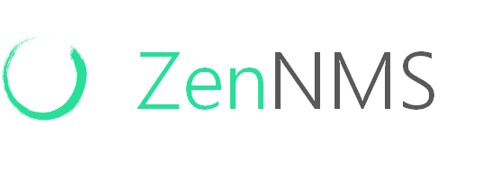
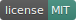

 

## About ZenNMS

## Contributing

Thank you for considering contributing to the ZenNMS! The contribution guide can be found in the [ZenNMS documentation](#).

## Code of Conduct

In order to ensure that the ZenNMS community is welcoming to all, please review and abide by the [Code of Conduct]().

## Security Vulnerabilities

If you discover a security vulnerability within ZenNMS, please send an e-mail to Angel Campos via [angel.campos.m@outlook.com](mailto:angel.campos.m@outlook.com). All security vulnerabilities will be promptly addressed.

## License

The ZenNMS is open-sourced software licensed under the [MIT license](https://opensource.org/licenses/MIT).