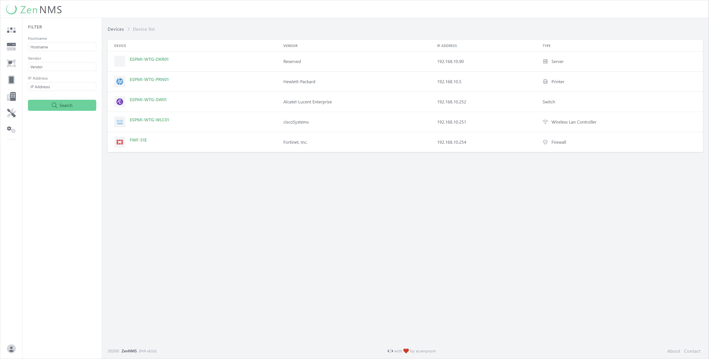
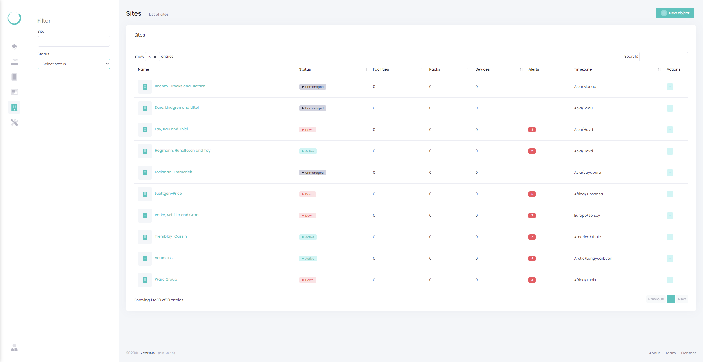
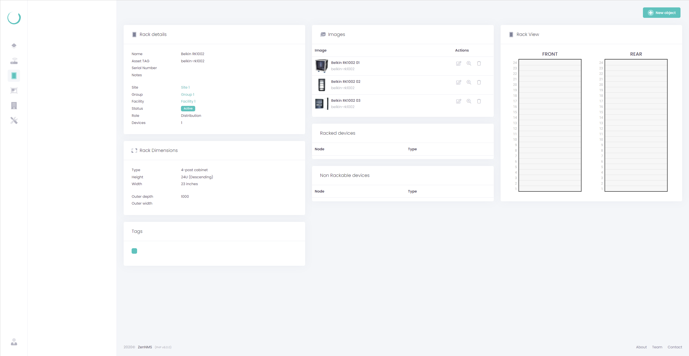

    

    
    
    

## Table of contents
- [About ZenNMS](#about-zennms)
- [Project Status](#project-status)
- [Technologies](#technologies)
- [Features](#features)
- [Screenshots](#screenshots)
- [Contributing](#contributing)
- [Code of Conduct](#code-of-conduct)
- [Security Vulnerabilities](#security-vulnerabilities)
- [License](#license)
   
## About ZenNMS
   
## Project Status
   
## Technologies
   
The ZenNMS project is created with:

- PHP8
- Laravel 8
- Tailwindcss
- eCharts

## Features

- Device management and monitoring
- Network discovery
- Rack Management
- Site

## Screenshots

### Devices List

### Device Entities

### Sites List

### Rack Details

## Contributing

Thank you for considering contributing to the ZenNMS! The contribution guide can be found in the [ZenNMS documentation](#).

## Code of Conduct

In order to ensure that the ZenNMS community is welcoming to all, please review and abide by the [Code of Conduct](.github/CODE_OF_CONDUCT.md).

## Security Vulnerabilities

If you discover a security vulnerability within ZenNMS, please send an e-mail to Angel Campos via [angel.campos.m@outlook.com](mailto:angel.campos.m@outlook.com). All security vulnerabilities will be promptly addressed.

## License

The ZenNMS is open-sourced software licensed under the [MIT license](https://opensource.org/licenses/MIT).
